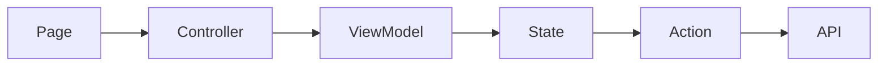
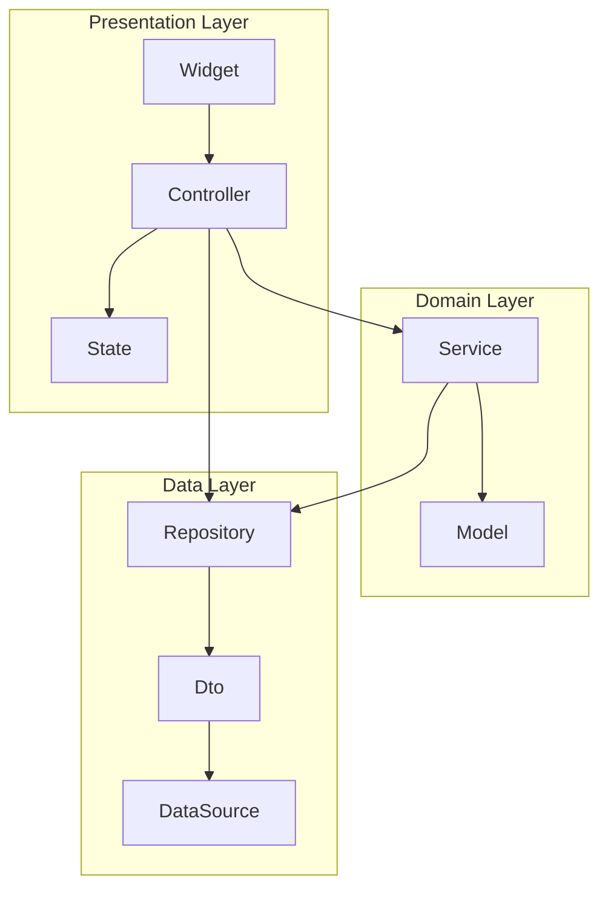

# 概要
この記事は下記記事の続きです。
https://zenn.dev/mixi/articles/transitioning-from-getx

前回の記事では、なぜGetXを乗り換えるに至ったかについて記載しました。
本記事では、GetXを使用したアーキテクチャの課題と、それを解決するためにriverpodへ移行した背景とその詳細について説明します。

# GetXを使って構成していたアーキテクチャ
riverpodの選択理由は「現状からの乗り換えやすさ」が1番の理由です。
そのため、まずはGetXを使ってどのようなアーキテクチャを構成していたかについて説明します。

## 初期アーキテクチャについて
最初のアーキテクチャ構成は下記のような図になっていました。


Reducerがないですが、Reduxな思想を持ったアーキテクチャです。
ControllerがPage(UI)のロジックを担う責務を持ち、ViewModelがUIの状態を保持します。
Actionは必要に応じてControllerから実行され、API呼び出しを行なってStateにレスポンスを格納し、必要に応じてViewModelがStateを参照します。

## 初期アーキテクチャの問題点について
プロジェクト立ち上げ当初はこのアーキテクチャを敷いていましたが、プロダクトが成熟するにつれ、問題がいくつか発生するようになりました。
このアーキテクチャで抱えていた問題は、GetXの辛さだけが理由ではありませんでした。
以下に詳細を説明します。

### 問題点①：コード記述量の多さによるコストパフォーマンスの悪さ
このアーキテクチャでは、どれほどシンプルなページであっても、必ずPage、Controller、ViewModel、State、Actionの5つのクラスファイルを用意
する必要があります。
コストパフォーマンスが悪いと感じるケースとして、例えばAPIを叩いてそのレスポンスを表示するだけのシンプルな画面を考えてみます。
この場合、以下のようなコードを書く必要があります。

```dart
import 'package:flutter/material.dart';
import 'package:get/get.dart';

class SamplePage extends GetView<SampleController> {
  const SamplePage({super.key});

  @override
  Widget build(BuildContext context) {
    return Scaffold(
      body: Obx(
        () => Text(
          controller.viewModel.response.toString(),
        ),
      ),
    );
  }
}

class SampleController extends GetxController {
  SampleViewModel get viewModel => Get.find<SampleViewModel>();

  @override
  void onInit() {
    super.onInit();
    _init();
  }

  Future<void> _init() async {
    await Get.find<SampleAction>().fetch();
  }
}

class SampleViewModel {
  SampleResponse get response => Get.find<SampleState>().response.value;
}

class SampleState {
  final Rxn<SampleResponse> response = Rxn();
}

class SampleAction {
  Future<void> fetch() async {
    // ここでAPIリクエストを行う
    final response = SampleResponse();
    Get.find<SampleState>().response.value = response;
  }
}

class SampleResponse {}
```

これだけでもコード記述量の多さ、要は面倒さが分かると思います。

さらに、我々のチームでは「ネイティブアプリ＝不具合が発生してもすぐに修正ができない」という点を踏まえて、テストカバレッジを上げてリスクヘッジを図る方針も採用していたため、上記のコードに加えてテストコードも実装する必要がありました。
我々のチームは小規模ですが、ネイティブアプリだけでなくWebアプリやサーバーサイドアプリの開発も行っているため、このコストパフォーマンスの悪さが大きなボトルネックとなっていました。（アプリの実装は時間がかかるから、、という会話が頻繁に聞かれるようにもなってしまっていました）
また、このアーキテクチャはネイティブアプリ独自の構成であったため、構成変更によるスイッチングコストも大きく、改善を迫られることになりました。

### 問題点②：コードの保守性と再現性に関する問題
ロジックのモジュール化やカプセル化が適切に行われていなかったため、コードのシンプルさや保守性が損なわれていた。

分かりやすい例として、下記のようなコードを考えます。

```dart
class SampleResponse {
  final String time;
  final bool notShowTime;

  const SampleResponse({
    required this.time,
    required this.notShowTime,
  });
}

class SampleHelper {
  DateTime _stringToDatetime(String time) {
    return DateTime.parse(time);
  }

  DateTime? formatTime(SampleResponse sample) {
    if (sample.notShowTime) {
      return null;
    }

    return _stringToDatetime(sample.time);
  }
}
```

時刻と、時刻を表示するかどうかを示すフラグを持つオブジェクトがある場合で、画面にどう表示するかをHelperクラスが担っています。
このオブジェクトを扱う画面が複数ある場合で、ロジックを共通化するために
このような実装になったものなのですが、本来であれば、こうした処理はモデルクラスを作成し、そのgetterメソッドとして実装すべきです。
しかし、わざわざHelperというクラスを作成し、依存関係を増やしてしまっていました。
また、依存関係が増えることで、GetXの扱いづらさとしてあげた依存管理の難しさも助長させてしまっていました。

このような問題は言語化が難しく、ベストな実装方法もケースバイケースであるため、コードレビューでしか防ぐことができず、レビュワーが気づかなければ問題視もされないという状況になってしまっていました。
さらに我々のプロジェクトでは、APIにGraphQLを採用しており、型の自動生成を行っていますが、Fragment Colocationを導入することで、ページごとに型が異なる状態になり、ロジックの共有化が現状のアーキテクチャではより難しくなるなど問題がさらに顕在化しました。

## 抱えていた問題に対する工夫について
行なった工夫は2点あります。どちらも単純な工夫ではありますが、それなりに効果があるものでした。
### 1. State層の廃止
APIのレスポンスをカプセル化するメリットよりも、クラス層が増えてコード記述量が増えてしまうデメリットの方が大きいという結論に至りました。
多くの場合においてState層はAPIレスポンスを保持しているだけで、結局ViewModel層を介してアクセスするだけなので、ViewModel層がState層のラッパークラスのような扱いになってしまい、恩恵をあまり受けられなかったという理由があります。

### 2. 無理な共通化をやめる
ケースバイケースで解決法が異なるため、無理に共通ロジックを使おうとせず、独自実装が必ずしも悪いことではないという意識を持つようにしました。
これにより、無理な共通ロジックの適用によって発生していた複雑さを軽減し、シンプルで理解しやすいコードを維持できるようになりました。

# riverpodへの乗り換えと新しいアーキテクチャについて
## riverpodの選択理由
riverpodの選択理由は「現状からの乗り換えやすさ」が１番の理由です。RxプログラミングであるGetXから比較するとstreamを使うようなbloc等よりは乗り換えがしやすいと判断しました。
また、以下の点においてもriverpodが適していると感じました。
- **ルールの明確化**: riverpodは実装のルールがある程度定義されており、コードのシンプルさを保つことができます。
特にriverpod_generatorを使ってコードの自動生成を行うことでさらにその恩恵を受けられると感じます。
これによって、知識の属人化も排除されるため、実装やレビューに迷うことも少なくなります。
- **習熟コスト**: ドキュメントが充実しており、比較的習得しやすいと感じました。
国内の人気の高さもあり、情報量の多さも魅力に感じました。

## riverpodを使った新アーキテクチャ
新しいアーキテクチャにはレイヤード型を採用し、最終的に下記のような構成となりました。



よくある構成なので詳細な説明は省きますが、下記の部分をメリットに感じています。
- **なじみのあるアーキテクチャ**
一般的なレイヤードアーキテクチャを採用することで、開発対象のスイッチングコストが小さくなりました。
- **責務分けの明確化**
クラスやレイヤーごとの責務が明示され、言語化が容易になりました。これにより、知識の属人化を防ぐことができます。
旧アーキテクチャでは、ControllerとViewModelの責務が曖昧であるという問題がありましたが、新アーキテクチャでは明確に分かれているため、大きなメリットを享受できています。
- **議論のしやすさ**
アーキテクチャに沿わないコードは、その是非を誰でも議論できるようになりました。例えば、前述のHelperクラスのようなアーキテクチャに存在しないコードは不要ではないかといった視点を持つことが容易になりました。

# まとめ
今回の記事では、GetXを使用したアーキテクチャの課題を整理し、それを解決するためにriverpodへ移行した背景と具体的な取り組みについて説明しました。G
etXを使用した初期アーキテクチャでは、コード記述量の多さや保守性の問題が顕著でしたが、riverpodを採用することでそれらの問題を軽減し、より効率的で保守しやすいアーキテクチャを構築することができました。
これからも、プロジェクトを進めていく中で、アーキテクチャや使用するライブラリの適切な選定と見直しを行いながら、より良い開発体制を築いていきたいと考えています。
