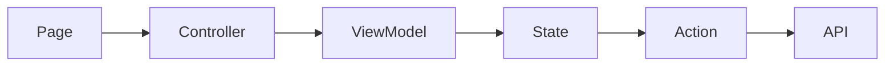
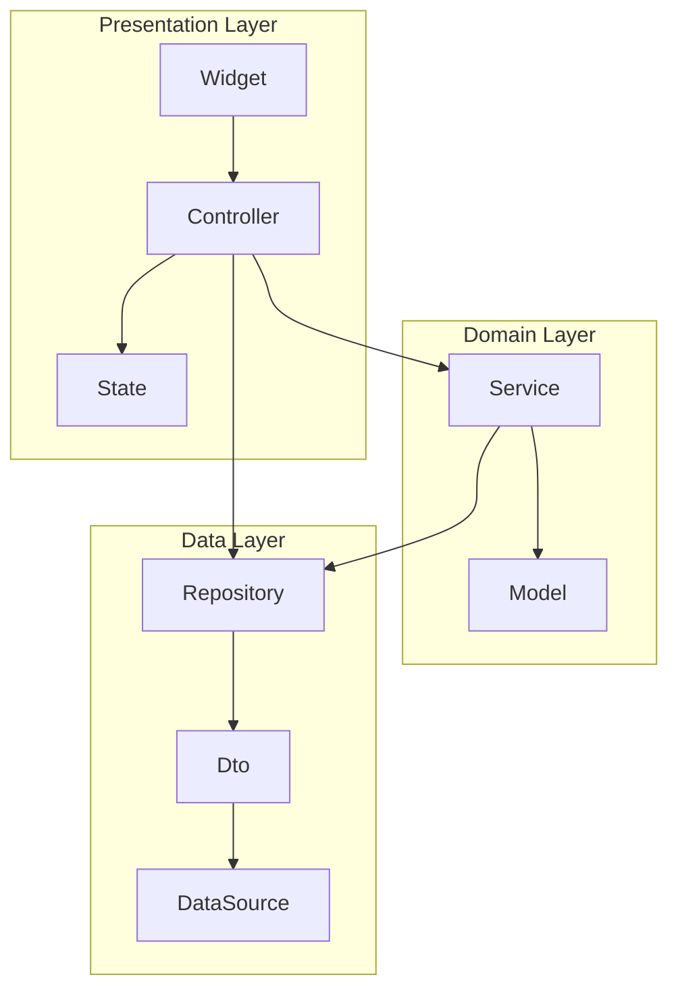

# 概要

# モジュール化、カプセル化の必要性を議論する

テスト時にモック化
テストを書くことが目的になってしまっていた。
flagment colocationによって問題が顕在化
各クラス層の責務を再定義

# 認知負荷、コード記述量の多さを減らすため、よりシンプルなクラス構成にする。
StateApiResponseの削除

# 依存関係の明確化
クラス内部でGet.find()するのをやめる。
