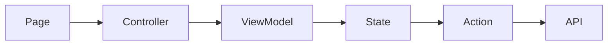
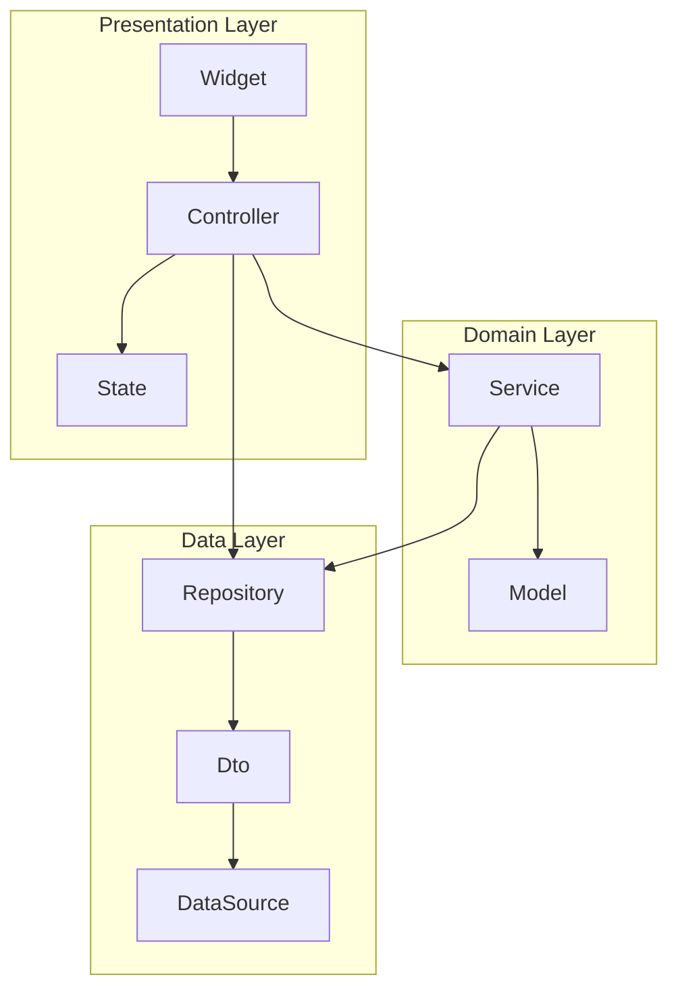

# 概要
この記事は下記記事の続きです。
https://zenn.dev/mixi/articles/transitioning-from-getx

前回の記事では、なぜGetXを乗り換えるに至ったかについて記載しました。
今回は、乗り換え先としてriverpodを選択した理由とGetXでの"失敗"を踏まえてどのような工夫を行なったかを説明します。

# 工夫について
riverpodの選択理由は「現状からの乗り換えやすさ」が1番の理由です。
まずは、GetXを使ってどのようなアーキテクチャを構成していたかについて説明します。

最初のアーキテクチャ構成は下記のような図になっていました。


Reducerがないですが、Reduxな思想を持ったアーキテクチャです。
ControllerがPage(UI)のロジックを担う責務を持ち、ViewModelがUIの状態を保持します。
Actionは必要に応じてControllerから実行され、API呼び出しを行なってStateにレスポンスを格納し、必要に応じてViewModelがStateを参照します。

プロジェクト立ち上げ当初はこのアーキテクチャを敷いていましたが、プロダクトが成熟していくにつれ、問題がいくつか発生するようになります。
これはGetXの辛さだけが理由ではありませんでした。

## 問題点①：コード記述量の多さによるコスパの悪さ
このアーキテクチャの場合、どれだけシンプルなページであってもPage,Controller,ViewModel,State,Actionの計5つのクラスファイルを必ず実装する必要があります。
加えて、我々のチームでは「ネイティブアプリ＝不具合が起きてもすぐの修正ができない」ため、なるべくテストカバレッジをあげてリスクヘッジしようという方針を決めていました。
ただし、UIにはまだまだ頻繁に変更が入るため、UI層はテストコードを書かなくてもいい（QAでカバレッジを担保しよう）という方針にしていました。

コスパが悪いと感じるケースですが、例えばAPIを叩いてそのレスポンスを表示するだけのシンプルな画面の場合を考えます。
この場合、下記のようなコードを書くことになります。
```dart
import 'package:flutter/material.dart';
import 'package:get/get.dart';

class SamplePage extends GetView<SampleController> {
  const SamplePage({super.key});

  @override
  Widget build(BuildContext context) {
    return Scaffold(
      body: Obx(
        () => Text(
          controller.viewModel.response.toString(),
        ),
      ),
    );
  }
}

class SampleController extends GetxController {
  SampleViewModel get viewModel => Get.find<SampleViewModel>();

  @override
  void onInit() {
    super.onInit();

    _init();
  }

  Future<void> _init() async {
    await Get.find<SampleAction>().fetch();
  }
}

class SampleViewModel {
  SampleResponse get response => Get.find<SampleState>().response.value;
}

class SampleState {
  final Rxn<SampleResponse> response = Rxn();
}

class SampleAction {
  Future<void> fetch() async {
    // ここでAPIリクエストを行う
    final response = SampleResponse();
    Get.find<SampleState>().response.value = response;
  }
}

class SampleResponse {}
```

これに加えてテストを実装するとそこそこ時間がかかります。
我々のチームはスモールチームでネイティブアプリ以外にもWebアプリとサーバーサイドアプリの開発も行なっているため、このコスパの悪さがかなりボトルネックに感じるようになりました。
また、このアーキテクチャはネイティブアプリ独自の構成であったため、スイッチングコストも大きく改善を余儀なくされました。

## 問題②：コードの保守性と再現性に関する問題
タイトルをつけるとすれば、「ロジックのモジュール化とカプセル化の重要性」としてはいかがでしょうか。これにより、以下のような全体像を持つ文章となります：

---

### ロジックのモジュール化とカプセル化の重要性
ロジックのモジュール化やカプセル化が適切に行われていなかったため、コードのシンプルさや保守性が損なわれていました。また、この問題を明確に言語化したり、ルールとして定義したりしていなかったため、開発者によってコードの書き方が異なり、再現性のない状態が問題となっていました。

例えば、同じオブジェクトを扱う異なる画面AとBがあるとします。このオブジェクトは時刻と、時刻を表示するかどうかを示すフラグを持っています。本来であれば、こうした処理はSampleというモデルクラスを作成し、そのgetterメソッドとして実装すべきです。しかし、わざわざHelperというクラスを作成し、依存関係を増やしてしまっています。

特に我々のプロジェクトでは、APIにGraphQLを採用しており、型の自動生成も行っています。しかし、Fragment Colocationを導入することで、ページごとに型が異なる状態になり、問題がさらに顕在化しました。

```dart
class SampleResponse {
  final String time;
  final bool notShowTime;

  const SampleResponse({
    required this.time,
    required this.notShowTime,
  });
}

class SampleHelper {
  DateTime _stringToDatetime(String time) {
    return DateTime.parse(time);
  }

  DateTime? formatTime(SampleResponse sample) {
    if (sample.notShowTime) {
      return null;
    }

    return _stringToDatetime(sample.time);
  }
}
```




# モジュール化、カプセル化の必要性を議論する

テスト時にモック化
テストを書くことが目的になってしまっていた。
flagment colocationによって問題が顕在化
各クラス層の責務を再定義

# 認知負荷、コード記述量の多さを減らすため、よりシンプルなクラス構成にする。
StateApiResponseの削除

# 依存関係の明確化
クラス内部でGet.find()するのをやめる。
